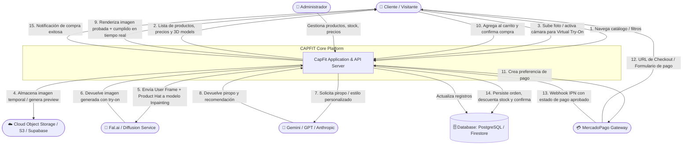

# CAPFIT — System Architecture & Data Design

This document details the **Data Relationship Model (Entity-Relationship Diagram / ERD)** and **Data Flow Diagram (DFD Level 0 & Level 1)** for transitioning CAPFIT from a client-side prototype to a full-stack, scalable e-commerce & AI virtual try-on platform.

---

## 1. Data Relationship Diagram (ERD)

```mermaid
erDiagram
    USERS ||--o{ ORDERS : places
    USERS ||--o{ TRYON_SESSIONS : generates
    USERS ||--o{ USER_FAVORITES : saves
    USERS ||--o| CARTS : owns

    CATEGORIES ||--o{ PRODUCTS : categorizes
    PRODUCTS ||--o{ PRODUCT_VARIANTS : has
    PRODUCTS ||--o{ PRODUCT_IMAGES : contains
    PRODUCTS ||--o{ REVIEWS : receives
    PRODUCTS ||--o{ CART_ITEMS : includes
    PRODUCTS ||--o{ ORDER_ITEMS : contains
    PRODUCTS ||--o{ TRYON_SESSIONS : tested_in

    PRODUCT_VARIANTS ||--o{ CART_ITEMS : selected_in
    PRODUCT_VARIANTS ||--o{ ORDER_ITEMS : purchased_in

    CARTS ||--o{ CART_ITEMS : contains

    ORDERS ||--|{ ORDER_ITEMS : contains
    ORDERS ||--|| PAYMENTS : processed_by
    ORDERS ||--|| SHIPMENTS : dispatched_via

    TRYON_SESSIONS ||--o| TRYON_RESULTS : produces

    %% Entity definitions & attributes
    USERS {
        uuid id PK "Identificador único"
        string email UK "Correo electrónico"
        string password_hash "Hash seguro de contraseña"
        string first_name "Nombre"
        string last_name "Apellido"
        string phone "Teléfono"
        enum role "CUSTOMER | ADMIN"
        timestamp created_at
        timestamp updated_at
    }

    CATEGORIES {
        string id PK "e.g. gorras, anteojos, accesorios"
        string name "Nombre visible"
        string slug UK
        string description
        boolean is_active
    }

    PRODUCTS {
        string id PK "Slug/ID único (e.g. clasica-negra)"
        string category_id FK
        string tipo "gorra | anteojos"
        string nombre "Título del producto"
        string marca "Marca (e.g. CAPFIT, Minimal)"
        string coleccion "Colección (e.g. Urbana, Clásica)"
        decimal precio "Precio actual (ARS/USD)"
        decimal precio_anterior "Precio anterior tachado"
        string badge "Más vendido | Oferta | Nuevo"
        float rating "Calificación promedio (0.0 - 5.0)"
        int reviews_count "Cantidad de reseñas"
        int total_stock "Stock consolidado"
        string model_3d_url "URL a modelo GLB/GLTF"
        jsonb detalles "Lista de especificaciones"
        boolean is_active
        timestamp created_at
    }

    PRODUCT_VARIANTS {
        uuid id PK
        string product_id FK
        string color_name "e.g. Negro, Azul Marino"
        string color_hex "Código hexadecimal (#111111)"
        string sku UK "Código de inventario único"
        int stock_quantity "Stock por variante de color"
        string image_preview_url "Foto lateral / miniatura"
        string image_frontal_url "Foto frontal usada para IA"
        boolean is_default
    }

    PRODUCT_IMAGES {
        uuid id PK
        string product_id FK
        string image_url
        string view_angle "front | side | back | 3d_preview"
        int display_order
    }

    CARTS {
        uuid id PK
        uuid user_id FK "Nullable para usuarios anónimos"
        string session_token UK "Cookie o token para invitados"
        timestamp expires_at
        timestamp updated_at
    }

    CART_ITEMS {
        uuid id PK
        uuid cart_id FK
        string product_id FK
        uuid variant_id FK
        int quantity
        decimal unit_price
        timestamp added_at
    }

    ORDERS {
        uuid id PK "ID interno de orden"
        string order_number UK "e.g. CPF-2026-00841"
        uuid user_id FK "Nullable si es checkout guest"
        string guest_email
        decimal subtotal "Suma de items"
        decimal shipping_cost "Costo de envío"
        decimal discount_amount "Descuentos aplicados"
        decimal total_amount "Monto total a pagar"
        enum status "PENDING | PAID | PROCESSING | SHIPPED | DELIVERED | CANCELLED"
        jsonb shipping_address
        timestamp created_at
        timestamp updated_at
    }

    ORDER_ITEMS {
        uuid id PK
        uuid order_id FK
        string product_id FK
        uuid variant_id FK
        string product_name
        string variant_color_name
        string variant_color_hex
        int quantity
        decimal unit_price
        decimal total_price
    }

    PAYMENTS {
        uuid id PK
        uuid order_id FK UK
        string provider "MERCADOPAGO | STRIPE"
        string external_payment_id "ID de pago en pasarela"
        string external_preference_id "Preference ID para Checkout Pro"
        decimal amount
        string currency "ARS | USD"
        enum status "PENDING | APPROVED | REJECTED | REFUNDED"
        jsonb gateway_response "Payload crudo del webhook"
        timestamp paid_at
        timestamp created_at
    }

    SHIPMENTS {
        uuid id PK
        uuid order_id FK UK
        string courier "Andreani | Correo Argentino | OCA"
        string tracking_number
        string tracking_url
        enum status "READY_TO_SHIP | IN_TRANSIT | DELIVERED | RETURNED"
        timestamp estimated_delivery
        timestamp shipped_at
    }

    TRYON_SESSIONS {
        uuid id PK
        uuid user_id FK "Nullable"
        string session_id "Token de sesión"
        string product_id FK
        uuid variant_id FK
        string input_image_url "Foto del usuario (redimensionada y optimizada)"
        string item_overlay_url "Foto frontal de la gorra"
        string fal_request_id "ID de petición asíncrona en Fal.ai"
        enum status "INITIATED | UPLOADED | PROCESSING | COMPLETED | FAILED"
        string error_message
        int processing_time_ms
        timestamp created_at
    }

    TRYON_RESULTS {
        uuid id PK
        uuid session_id FK UK
        string output_image_url "Imagen generada con la gorra puesta"
        string piropo_text "Cumplido generado por IA"
        float confidence_score
        timestamp created_at
    }

    REVIEWS {
        uuid id PK
        string product_id FK
        uuid user_id FK
        int rating "1 a 5"
        string comment
        string user_name
        boolean verified_purchase
        timestamp created_at
    }

    USER_FAVORITES {
        uuid user_id PK, FK
        string product_id PK, FK
        timestamp created_at
    }
```

---

## 2. Data Flow Diagram (DFD)

### Level 0: Context Data Flow Diagram



---

### Level 1: Detailed Subsystem Data Flow Diagram

```mermaid
flowchart TD
    %% Entities
    Client[Cliente Browser / Mobile]
    
    %% Subsystems / Processes
    P1[1.0 Catalog & 3D Viewer Engine]
    P2[2.0 Face Detection & Virtual Try-On Pipeline]
    P3[3.0 Cart & Session Manager]
    P4[4.0 Checkout & Payment Processor]
    P5[5.0 AI Compliment & Recommendation Engine]

    %% Data Stores
    D1[(D1: Products & Variants Store)]
    D2[(D2: Try-On Session History)]
    D3[(D3: Cart & Saved Items Store)]
    D4[(D4: Orders & Payments Store)]
    D5[(D5: Media & Assets Storage)]

    %% External APIs
    Ext_Fal[Fal.ai / Inpainting API]
    Ext_LLM[Google Gemini / Anthropic API]
    Ext_MP[MercadoPago REST API]

    %% Flows - Catalog
    Client -->|1.1 Request Catalog Filters & Items| P1
    P1 <-->|1.2 Fetch Products, Variants, Stock| D1
    P1 <-->|1.3 Load 3D GLB & Product Images| D5
    P1 -->|1.4 Catalog View & 3D Interactive Canvas| Client

    %% Flows - Try-On
    Client -->|2.1 Send Camera Feed / Upload Image| P2
    P2 -->|2.2 Client-side Face Verification / Quality Check| P2
    P2 -->|2.3 Upload Input Face Image| D5
    P2 -->|2.4 Trigger Inpainting Request with Product Frontal| Ext_Fal
    Ext_Fal -->|2.5 Poll / Return Inpainted Result Image| P2
    P2 -->|2.6 Save Session & Result| D2
    P2 -->|2.7 Request Style Compliment| P5
    P5 <-->|2.8 Call Generative Model with Hat Metadata| Ext_LLM
    P5 -->|2.9 Return Piropo & Styling Tip| P2
    P2 -->|2.10 Stream Final Try-On Result & Social Share Card| Client

    %% Flows - Cart
    Client -->|3.1 Add Variant / Update Quantity| P3
    P3 <-->|3.2 Validate Real-time Stock| D1
    P3 <-->|3.3 Persist Cart State| D3
    P3 -->|3.4 Cart Badge & Subtotal / Free Shipping Meter| Client

    %% Flows - Checkout & Payment
    Client -->|4.1 Submit Customer Data & Shipping Address| P4
    P4 <-->|4.2 Load Active Cart Items| D3
    P4 -->|4.3 Create Preference Payload| Ext_MP
    Ext_MP -->|4.4 Return Init Point / Preference ID| P4
    P4 -->|4.5 Redirect to MercadoPago Modal / Hosted Checkout| Client
    Ext_MP -->|4.6 Webhook Notification (Payment Status)| P4
    P4 -->|4.7 Decrement Product Variant Stock| D1
    P4 -->|4.8 Create Order & Payment Record| D4
    P4 -->|4.9 Clear Active Cart| D3
    P4 -->|4.10 Send Confirmation Receipt & Tracking| Client
```

---

## 3. Core API Endpoint Matrix

| Method | Endpoint | Description | Input Payload | Output Payload |
|---|---|---|---|---|
| **GET** | `/api/products` | Retrieve filtered catalog items | `?tipo=gorra&coleccion=Urbana&sort=price_asc` | `Product[]` with variants, prices, images |
| **GET** | `/api/products/:id` | Get single product with 3D model & details | Product ID / slug | `ProductDetails` |
| **POST** | `/api/tryon/submit` | Initiate asynchronous Virtual Try-On job | `{ image_url, hat_url, product_id, color_hex }` | `{ request_id, status: "IN_QUEUE" }` |
| **GET** | `/api/tryon/status/:id` | Check status of Virtual Try-On generation | Request ID | `{ status: "COMPLETED", output_url: "..." }` |
| **POST** | `/api/ai/piropo` | Generate personalized compliment & review | `{ product_name, brand, style_type }` | `{ piropo: "...", tip: "..." }` |
| **POST** | `/api/cart/sync` | Synchronize guest/user cart state | `{ items: [{ product_id, variant_id, qty }] }` | `{ items, subtotal, shipping_cost, total }` |
| **POST** | `/api/checkout/preference` | Generate MercadoPago checkout preference | `{ cart_id, customer_info, shipping_address }` | `{ preference_id, init_point }` |
| **POST** | `/api/webhooks/mercadopago` | Payment status webhook notification | IPN payload / Signature | `{ received: true }` |
| **GET** | `/api/orders/:id` | Order status and tracking tracking info | Order ID / access token | `OrderDetails & Tracking` |

---

## 4. Key Architectural Decisions for Production Backend

1. **Decoupled AI Pipeline with Asynchronous Jobs**:
   - Heavy image-to-image inpainting tasks run asynchronously using webhooks or status polling (`/api/tryon/submit` $\rightarrow$ `/api/tryon/status`), preventing Node.js event loop blocks.
2. **Deterministic Fallbacks**:
   - The browser-side camera engine utilizes Face-API + color space analysis for instant face validation before making backend server calls, reducing unnecessary server and API costs.
3. **Robust Stock & Concurrency Controls**:
   - Inventory decrements occur on database transactions upon verified payment webhooks from MercadoPago to avoid overselling.
4. **Clean Domain Separation**:
   - Modular architecture separating **Catalog Services**, **AI Services**, **Cart & Order Services**, and **Payment Gateway Handlers**.
